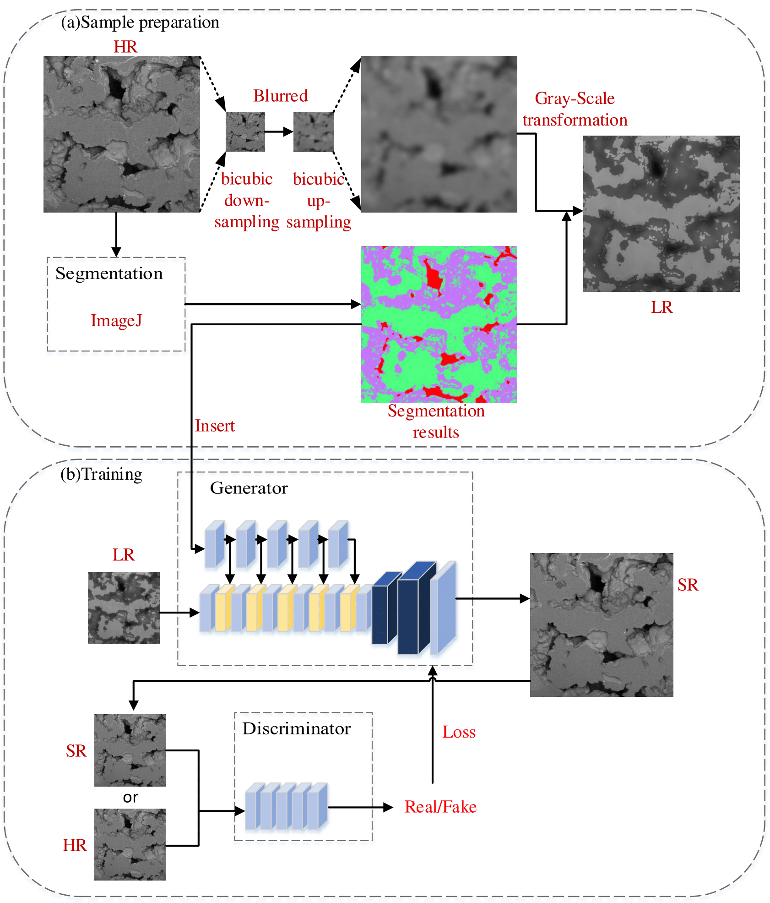

# GuidedSR

This is the official repository for "A Novel GAN-Based Super-Resolution Method: Targeting Pore Wall Restoration with Semantic Guidance from Depth Information and Regional Feature Variations". Please cite this work if you find this repository useful for your project. 

Most current super-resolution methods focus on the gray-scale variation or pixel distribution, while neglecting the geological feature correlations among the information extracted from the images， which will affect the accuracy of physical parameters obtained from numerical simulations. To address this limitation, we propose a novel GAN-based super-resolution method that leverages depth information and regional feature variations as semantic guidance to reconstruct pore wall textures. A guided information-sharing mechanism is introduced to integrate depth feature maps and geological semantic maps into the network, thereby directing high-resolution image generation. To address the issue of lacking paired data, we propose a degradation method that generates a dataset by degrading high-resolution images based on image features. This approach better reflects the differences between actual high and low-resolution images than simple down-sampling. Furthermore, diverging from conventional metrics like peak signal-to-noise ratio that tend to prioritize blurry outputs, we design a new evaluation metrics emphasizing structural authenticity. Comparative experiments validate the superiority of our method in both visual quality and geological fidelity. Finally, we apply the results to permeability analysis, confirming that our generated results closely resemble high-resolution images regarding fine textures.





## Usage

The model is run through a command line interface. We strongly recommend installing [Anaconda](https://www.anaconda.com/products/individual) as it includes most of the packages needed for this code base, and the ``conda`` package management system is able to install almost everything required. 


### Data 

Image data is expected to be stored using the following file structure for data loaders:

```
./images/
|
+--train/
|  +--txm/
|     +--[image number with three digits e.g. 000 or 015].tif
|  +--sem/
|     +--[image number].tif
|  +--charge/
|     +--[image number].tif
|  +--lowdensity/
|     +--[image number].tif
|  +--highdensity/
|     +--[image number].tif
|
+--val/
|  + ...
+--test/
|  + ...
|  +--txm_full_stack/
|     +--[image number in z-axis order, unrelated to the numbers of the aligned slices].tif
```
The data loaders rely on folders and filenames appearing in this specific form. If the images are not places in the correct folder, the dataloader will not be able to find them. Aligned image slices should appear with the same file names in the `txm`, `sem`, `charge`, `lowdensity`, and `highdensity` folders. This is how the code is able to track which slices are aligned with which. The `txm_full_stack` folder in the `test/` contains TXM images from a contiguous volume where each slice is numbered according to its slice number in the z-axis.

Dataset files can be found in the `./data/` folder. The framework implements four data loaders depending on the application. The specific dataset to use is selected with the `--dataset` option during training and testing.


### Training a model

The model is trained using the ``train.py`` script. For example, you can train a model using the following code: 

```
python train.py --name srgan_img100 --model srgan --netG sr_resnet_9blocks --niter 50 --niter_decay 25 --downsample_factor 4 --patch_size 128 --lambda_img_grad 1e-4
```

The pre-trained model is saved as iter_4_net_G.pth and can be find in directory `pretrained`. It is used for patch_size=256.


### Loading and testing a model 

The framework is automatically able to load a model based on the model name. To load a model, 

```
./checkpoints
|
+--/[model name]
   |
   +--[epoch #]_net_[net name].pth
   +--latest_net_[net name].pth

```

To test and evaluate a model, use:

```
python test.py --name srgan_example --model srgan --netG sr_resnet_9blocks --downsample_factor 4 --patch_size 128
```


To evaluate for 3D volume model, you must use the txm2sem3d dataset mode. Besides this, the command line argument is very similar:

```
python test.py --name srgan_example --model srgan --netG sr_resnet_9blocks --downsample_factor 4 --patch_size 128 --dataset_mode txm2sem3d --x_ind [x index] --y_ind [y index] --save_name [save name] 
```


## Acknowledgements

The code presented is mainly from the [original pix2pix code](https://github.com/junyanz/pytorch-CycleGAN-and-pix2pix) published by [Jun-Yan Zhu](https://github.com/junyanz) and [Taesung Park](https://github.com/taesung), and supported by [Tongzhou Wang](https://ssnl.github.io/). The relevant papers are:

- Unpaired Image-to-Image Translation using Cycle-Consistent Adversarial Networks. Jun-Yan Zhu*, Taesung Park*, Phillip Isola, Alexei A. Efros. In ICCV 2017. 

- Image-to-Image Translation with Conditional Adversarial Networks. Phillip Isola, Jun-Yan Zhu, Tinghui Zhou, Alexei A. Efros. In CVPR 2017. 

- Anderson T I, Vega B, Kovscek A R. Multimodal imaging and machine learning to enhance microscope images of shale[J] Computers & Geosciences, 2020, 145: 104593.
